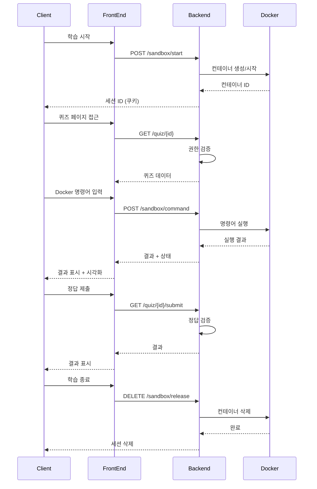

   <h1> 🐳 LearnDocker 🐳 </h1>
   <h3> Docker에 대해서 알고싶으신가요? 샌드박스 환경을 통해 단계별 학습을 해봅시다. 시각화는 덤입니다! </h3>

  <a href="http://211.188.54.226:3000">LearnDocker 홈페이지</a>

  

  <a href="https://github.com/boostcampwm-2024/web34-LearnDocker/wiki">📚 프로젝트 위키</a>
  &nbsp; | &nbsp; 
  <a href="https://www.figma.com/design/ClXaOWYkYfv4tgEanGfBq6/%EB%A0%88%EC%9D%B4%EC%95%84%EC%9B%83-%EC%84%A4%EA%B3%84?node-id=5-2&t=q44ZHiTVNWr6VRPU-1">🎨 디자인</a>
  &nbsp; | &nbsp; 
  <a href="https://github.com/orgs/boostcampwm-2024/projects/133/views/1">📋 백로그</a>

# 🚀 프로젝트 개요
## 💡 LearnDocker란 무엇인가?
- "Docker를 배우고 싶은데 설치가 너무 부담스러워요..."  
이러한 고민을 해결하기 위해 탄생한 LearnDocker는 웹 브라우저만으로 Docker의 핵심 개념과 명령어를 학습할 수 있는 온라인 플랫폼입니다.  
 실제 Docker 환경의 동작을 실시간 애니메이션으로 보여주며, 직관적인 시각화를 통해 복잡한 Docker의 개념을 쉽게 이해할 수 있습니다.  
- 📅 개발 기간: 2024-10-28(월) ~

## 🎯 LearnDocker는 무엇을 위해 사용하나요?
LearnDocker는 다음과 같은 사용자들을 위해 설계되었습니다:
  - Docker를 처음 접하는 개발자
  - Docker 설치 없이 개념을 학습하고 싶은 학습자
  - Docker의 동작 방식을 시각적으로 이해하고 싶은 사람
  - 안전한 환경에서 Docker 명령어를 실습하고 싶은 사람

## 🌟 LearnDocker는 어떤 문제를 해결하나요?
> **기존의 Docker 학습도구(예: Play with Docker)와 비교 했을때, LearnDocker는 다음과 같은 차별점을 제공합니다.**

- **통합된 학습 경험**
    - 이론 설명, 실습 문제, 시각화가 하나의 플랫폼에서 제공
    - 단계별로 구조화된 학습 커리큘럼
- **실시간 시각화**
    - Docker 작업의 실시간 시각적 피드백
    - 이미지와 컨테이너의 상태 변화를 애니메이션으로 표현
- **단계별 실습**
    - 각 Docker 개념에 대한 맞춤형 실습 문제
    - 즉각적인 피드백을 통한 학습 검증
    - 실수를 통한 학습이 가능한 안전한 환경

# ✨ 주요 기능
## 📚 통합된 학습 경험

## 🎯 실시간 시각화

## 🔄 단계별 실습

## ⚒️ 기술 스택 
| 분류 | 기술 |
| ---- | ---- |
| 🎨 프론트엔드 |   |
| 🔧 백엔드 |     |
| 🔨 공통 |  |
 

## 🏗️ 아키텍처 설계
### 간단한 서버 구조

### 백엔드 서버 아키텍처

### 명령어 흐름도

[상황별 자세한 시퀀스 다이어그램](https://github.com/boostcampwm-2024/web34-LearnDocker/wiki/시퀀스-다이어그램)

## 🤔기술적 도전

### 1. 사용자에 따른 서버 리소스 관리

#### 주요 도전 과제

1. 세션 테이블을 활용한 사용자의 세션 관리(세션 생성 및 해제)
2. 사용자 상호작용(탭 닫기, 30분 상호작용 없음)에 따른 서버 세션 및 호스트 컨테이너 관리
3. 악의적인 사용자의 연속 요청에 대한 처리

#### Wiki  개발 일지

- [사용자 세션해제기능 및 IP를 통한 세션관리](https://github.com/boostcampwm-2024/web34-LearnDocker/wiki/[5주-2일차-‐-J048-김영관]-개발-일지(세션해제-및-IP를-통한-세션관리))
- [사용자의 연속 요청 처리 및 세션 관리](https://github.com/boostcampwm-2024/web34-LearnDocker/wiki/[5주-3일차-‐-J048-김영관]-개발-일지(연속요청-처리-및-세션관리))
- [사용자가 탭을 닫을 시 세션 관리 및 상호작용이 없을 시에 대한 처리](https://github.com/boostcampwm-2024/web34-LearnDocker/wiki/[5주-6일차-‐-J048-김영관]-개발-일지(탭-닫을-시-세션-해제-및-세션-관리2))

### 2. 샌드박스 서버 보안 조치 (레지스트리, 프록시 서버)

  
  

  
  

#### 참고 자료

private 레지스트리 관련 회의록

- [24.11.11](https://github.com/boostcampwm-2024/web34-LearnDocker/wiki/%5B2024%E2%80%9011%E2%80%9011%5D-%ED%8C%80-%ED%9A%8C%EC%9D%98#docker-image%EB%A5%BC-docker-hub%EC%97%90%EC%84%9C-%EA%B0%80%EC%A0%B8%EC%98%A4%EA%B2%8C-%EB%90%9C%EB%8B%A4%EB%A9%B4-%EC%9D%B8%ED%84%B0%EB%84%B7%EC%97%90-%EC%A0%91%EC%86%8D%ED%95%B4%EC%95%BC-%ED%95%98%EB%8A%94%EB%8D%B0-%EC%96%B4%EB%96%BB%EA%B2%8C-%EC%B2%98%EB%A6%AC%ED%95%B4%EC%95%BC-%ED%95%A0%EA%B9%8C)
- [24.11.12](https://github.com/boostcampwm-2024/web34-LearnDocker/wiki/%5B2024%E2%80%9011%E2%80%9012%5D-%ED%8C%80-%ED%9A%8C%EC%9D%98#%EB%8F%84%EC%BB%A4-registry-%EA%B4%80%EB%A0%A8)
- [24.11.19](https://github.com/boostcampwm-2024/web34-LearnDocker/wiki/%5B4%EC%A3%BC%EC%B0%A8%5D-%ED%8C%80-%ED%9A%8C%EC%9D%98%282024%E2%80%9011%E2%80%9019%29)

private 레지스트리 관련 개발 일지

- [NCP VPC 서브넷 보안그룹 설정](https://github.com/boostcampwm-2024/web34-LearnDocker/wiki/%EA%B0%9C%EB%B0%9C%EA%B8%B0%EB%A1%9D_J114%EB%B0%95%EC%84%B8%ED%99%98_3%EC%A3%BC5%EC%9D%BC%EC%B0%A8_NCP-VPC-%EC%84%9C%EB%B8%8C%EB%84%B7-%EB%B3%B4%EC%95%88%EA%B7%B8%EB%A3%B9-%EC%84%A4%EC%A0%95)

사용자 명령어 유효성 검사 관련 개발 일지

- [3주 2일차 - J048_김영관 개발 일지](https://github.com/boostcampwm-2024/web34-LearnDocker/wiki/%5B3%EC%A3%BC-2%EC%9D%BC%EC%B0%A8-%E2%80%90-J048-%EA%B9%80%EC%98%81%EA%B4%80%5D-%EA%B0%9C%EB%B0%9C-%EC%9D%BC%EC%A7%80)

### 3. 시각화를 어떻게 할 것인가

#### 팀 구성

- 전체 4명의 팀원 모두가 백엔드 개발자로 구성
- 특히 react는 전부 처음 사용

#### 주요 도전 과제

1. Docker의 아키텍처를 어떻게 시각적으로 표현할 것인가?
2. Docker 명령어 실행에 따른 상태 변화를 어떻게 표현 할 것인가?
3. 기본적인 웹 지식만으로 동적 시각화를 어떻게 구현할 것인가?

#### Wiki 개발 일지

- [시각화 설계](https://github.com/boostcampwm-2024/web34-LearnDocker/wiki/%5B3%EC%A3%BC-1%EC%9D%BC%EC%B0%A8---J278-%ED%99%8D%EA%B7%9C%EC%84%A0%5D-%EA%B0%9C%EB%B0%9C-%EC%9D%BC%EC%A7%80%28%EC%8B%9C%EA%B0%81%ED%99%94-%EC%84%A4%EA%B3%84%29)
- [이미지 상태 시각화 구현](https://github.com/boostcampwm-2024/web34-LearnDocker/wiki/%5B3%EC%A3%BC-2%EC%9D%BC%EC%B0%A8---J278-%ED%99%8D%EA%B7%9C%EC%84%A0%5D-%EA%B0%9C%EB%B0%9C-%EC%9D%BC%EC%A7%80(%EC%9D%B4%EB%AF%B8%EC%A7%80-%EC%83%81%ED%83%9C-%EC%8B%9C%EA%B0%81%ED%99%94-%EA%B5%AC%ED%98%84))
- [이미지 흐름 시각화 구현](https://github.com/boostcampwm-2024/web34-LearnDocker/wiki/%5B3%EC%A3%BC-3%EC%9D%BC%EC%B0%A8---J278-%ED%99%8D%EA%B7%9C%EC%84%A0%5D-%EA%B0%9C%EB%B0%9C-%EC%9D%BC%EC%A7%80(%EC%9D%B4%EB%AF%B8%EC%A7%80-%ED%9D%90%EB%A6%84-%EC%8B%9C%EA%B0%81%ED%99%94-%EA%B5%AC%ED%98%84))
- [이미지 시각화 리팩토링](https://github.com/boostcampwm-2024/web34-LearnDocker/wiki/%5B3%EC%A3%BC-4%EC%9D%BC%EC%B0%A8---J278-%ED%99%8D%EA%B7%9C%EC%84%A0%5D-%EA%B0%9C%EB%B0%9C-%EC%9D%BC%EC%A7%80(%ED%94%84%EB%A1%A0%ED%8A%B8%EC%97%94%EB%93%9C-%EC%BD%94%EB%93%9C-%EB%A6%AC%ED%8C%A9%ED%86%A0%EB%A7%81))
- [화살표 애니매이션 버그 수정](https://github.com/boostcampwm-2024/web34-LearnDocker/wiki/%5B4%EC%A3%BC-4%EC%9D%BC%EC%B0%A8---J278-%ED%99%8D%EA%B7%9C%EC%84%A0%5D-%EA%B0%9C%EB%B0%9C-%EC%9D%BC%EC%A7%80(%ED%99%94%EC%82%B4%ED%91%9C-%EC%95%A0%EB%8B%88%EB%A7%A4%EC%9D%B4%EC%85%98-%EB%B2%84%EA%B7%B8-%EC%88%98%EC%A0%95))
- [컨테이너 시각화](https://github.com/boostcampwm-2024/web34-LearnDocker/wiki/%5B4%EC%A3%BC-6%EC%9D%BC%EC%B0%A8-%E2%80%90-J048-%EA%B9%80%EC%98%81%EA%B4%80%5D-%EA%B0%9C%EB%B0%9C-%EC%9D%BC%EC%A7%80)
- [컨테이너 시각화 버그 수정 및 리팩토링](https://github.com/boostcampwm-2024/web34-LearnDocker/wiki/%5B5%EC%A3%BC-1%EC%9D%BC%EC%B0%A8-%E2%80%90-J048-%EA%B9%80%EC%98%81%EA%B4%80%5D-%EA%B0%9C%EB%B0%9C-%EC%9D%BC%EC%A7%80(Docker%EC%8B%9C%EA%B0%81%ED%99%94-%EB%B2%84%EA%B7%B8-%EC%88%98%EC%A0%95-%EB%B0%8F-%EB%A6%AC%ED%8C%A9%ED%86%A0%EB%A7%81))

### 4. 17초 지연 이슈 해결 과정 (로딩, SSE, tls=false)

#### Wiki 개발 일지

- [SSE 적용 및 로딩 터미널](https://github.com/boostcampwm-2024/web34-LearnDocker/wiki/[5주-4일차-‐-J034-김두종]-개발-일지(17초-지연-이슈-해결-과정))
- [tls=false 옵션 적용](https://github.com/boostcampwm-2024/web34-LearnDocker/wiki/개발기록_J114박세환_5주3일차---dockerd-startup-delayed-for-17-seconds)
